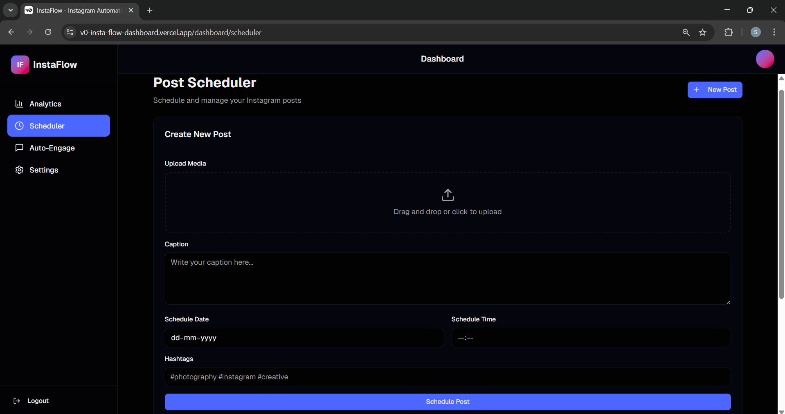

# 🤖 InstaFlow – AI-Powered Instagram Automation Dashboard

✨ **InstaFlow** is a futuristic automation system designed for Instagram creators and marketers.  
Automate post scheduling, manage analytics, and enhance engagement — all in one elegant dashboard.

---
🔗 Live Demo

👉 Website:https://v0-insta-flow-dashboard.vercel.app/

👉 GitHub Repository: https://github.com/Sandhiyamrs/project-Instagram-Automation.git

---

## 🌈 Features
- 📸 Auto-schedule Instagram posts with captions and hashtags  
- 📊 AI-powered analytics dashboard  
- 💬 Engagement automation (likes, follows, comments)  
- 🔐 Secure login & API integration  
- 🌐 Real-time insights on reach & followers  

---
## 📸 Project Screenshots

### 🏠 Home Page
<p align="center">
  
</p>

### ⚙ Analytics Page
<p align="center">
  
</p>

### 🎨 Scheduler Page
<p align="center">
  
</p>

### ⚙ Auto engage Page
<p align="center">
  
</p>

### ⚙ Settings1 Page
<p align="center">
  
</p>

### ⚙ Settings2 Page
<p align="center">
  
</p>

---

## 🛠️ Tech Stack
| Frontend | Backend | Hosting |
|-----------|----------|---------|
| HTML, CSS, JS | Python (Flask / Selenium) | **Vercel** |

---

## 🚀 Live Demo
🎯 **Experience InstaFlow here:**  
👉 [Live on Vercel](https://v0-insta-flow-dashboard.vercel.app/)

---
👩‍💻 Author : Sandhiya M

🐙 GitHub: https://github.com/Sandhiyamrs

📧 Email: sandhiyamrs2006@gmail.com

---

⭐ Support

If you found this project useful, please ⭐ the repo!

## 💻 How to Run Locally
```bash
# Clone the repository
git clone https://github.com/<your-username>/InstaFlow-Automation-Dashboard.git
cd InstaFlow-Automation-Dashboard

# Install dependencies
pip install -r requirements.txt

# Run locally
python main.py
